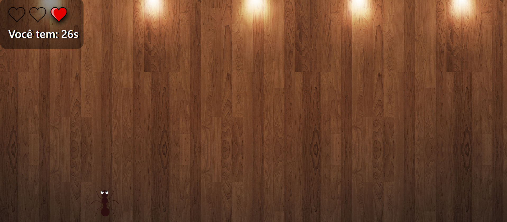

# Game mata formigas
Esse jogo foi desenvolvido para colocar em prática o projeto do curso da Udemy de desenvolvimento web.

## :computer:Tecnologias utilizadas:
+ HTML e CSS
+ Bootstrap
+ JavaScript

## :pushpin:Referência:
[Desenvolvimento Web - Udemy](https://www.udemy.com/course/web-completo/?couponCode=LEADERSALE24A)

## :diamonds:Link:
[Game mata formiga](https://francine02.github.io/Mata-Formiga/)

